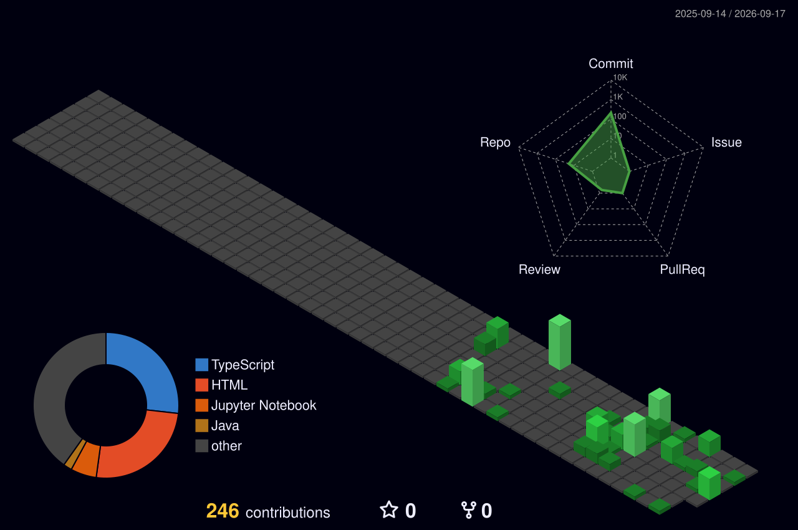

<div align="center">


<br/>


<a href="https://abdul-wahid-portfolio.vercel.app/CV.pdf">
  
</a>

</div>

---

## 🧠 About Me

```python
class AbdulWahid:
    def __init__(self):
        self.name        = "Abdul Wahid"
        self.role        = "AI / ML Developer"
        self.university  = "COMSATS University Islamabad, ATTOCK Campus"
        self.degree      = "BS Artificial Intelligence"
        self.location    = "Pakistan 🇵🇰"
        self.email       = "inbox.abdulwahid@gmail.com"
        self.website     = "https://www.abdulwahid.me"
        self.languages   = ["Python", "Java"]
        self.interests   = ["Machine Learning", "Data Science", "Software Engineering", "AI Research"]
        self.available   = True  # Open to opportunities!

    def say_hi(self):
        print("Thanks for stopping by! Let's build something amazing with AI")

me = AbdulWahid()
me.say_hi()
```

---

## 🔗 Connect With Me

<div align="center">

[![Portfolio](https://img.shields.io/badge/-000000?style=for-the-badge&logo=data:image/svg%2Bxml;base64,PHN2ZyB4bWxucz0iaHR0cDovL3d3dy53My5vcmcvMjAwMC9zdmciIHZpZXdCb3g9IjAgMCAyNCAyNCI+PHBhdGggZmlsbD0iI0ZGRiIgZD0iTTEyIDBDNS4zNzMgMCAwIDUuMzczIDAgMTJzNS4zNzMgMTIgMTIgMTIgMTItNS4zNzMgMTItMTJTMTguNjI3IDAgMTIgMHptNi44MzcgNS43NTNsLTMuMzI4IDEuOTU2Yy40NTEtLjkzLjc1NC0xLjkyLjg5NC0yLjkyMyAxLjE1Ni4wOTkgMi4yMS40NjQgMy4wOSAxLjAxOGwtLjY1Ni0uMDUxem0tNS40ODUtMy4zNzZjMS4zNzguMTA2IDIuNjU2Ljc0MSAzLjY1NCAxLjcwN2wtMy41NyAyLjA5N2MtLjAxNS0uODE1LS4wNTItMS42MTEtLjExNi0yLjM4NHYtMS40MnptLTIuODItLjI5NHYxLjQ0MmMtLjA2Ny43OTQtLjEwNSAxLjYxMS0uMTIyIDIuNDQzTDYuODcgMy44ODJjMS4wMi0xLjAyNSAyLjMzNi0xLjcwOCAzLjc1Ny0xLjgxNWwtLjEyNC4wMTd6bS00LjM5NCAxLjk3N2wzLjUwNCAyLjA1N2MtLjEyMiAxLjA1NC0uMzkzIDIuMDk3LS44MDMgMy4xMDRsLTMuNjYzLTIuMTVjLjE2Mi0uOTc5LjUyMS0xLjg5NSAxLjA1NC0yLjcybC0uMDkyLS4yOTF6bS0xLjg5IDMuMTExbDMuNzUgMi4yMDJjLS41MiAxLjA5Ni0xLjEyNyAyLjEyNy0xLjc5NCAzLjA5N2wtMy43OTItMi4yMjdjLjUwNC0xLjA1OCAxLjE0NC0yLjA0NSAxLjgzNi0zLjA3MnptLTIuMDIzIDMuNjI2bDMuODcgMi4yNzRjLS42NzIgMS4wNDctMS40MDUgMi4wNTQtMi4xODggMy4wMTFsLTMuOTIxLTIuMzA0Yy41OTQtMS4wMDIgMS4zNDEtMS45NTQgMi4yMzktMi45ODF6bTIuMzY4IDMuNTI4bDMuOTYzIDIuMzI3Yy0uODg2Ljk3NC0xLjg0OCAxLjg5NS0yLjg2OCAyLjc2NkwzLjkyIDE3LjU4N2MuODAxLS45ODkgMS43NTgtMS45MzQgMi42NzUtMi44NzFsLS4xMDUtLjM5em0zLjE3OCAzLjIzOWwzLjk5OSAyLjM1Yy0xLjE0NC44MjUtMi4zNjggMS41NzktMy42NTUgMi4yNTlsLTMuOTgtMi4zNGMxLjE1Ny0uNzA0IDIuMzQxLTEuNDY0IDMuNjM2LTIuMjY5em00LjI3NiAyLjY4bDQuMDMyIDIuMzY4Yy0xLjQzOS41NjctMi45NTEuOTk2LTQuNTIxIDEuMjgydi0zLjY1em00Ljg0Ni0xLjUwM2w0LjAzLTIuMzY3Yy0uMjAxIDEuMDI3LS41MTQgMi4wMjItLjkyNiAyLjk3MmwtNC4wMDQtMi4zNTJjLjI4Ny0uODAxLjUyMy0xLjYxLjY4OC0yLjQyOGwuMjEyLTEuMjU4em0tLjY3LTMuMTM2bDMuOTc4LTIuMzM2Yy0uMzY1IDEuMDgyLS44MjMgMi4xMjItMS4zNjUgMy4xMTJsLTMuOTI3IDIuMzA4Yy40NTEtLjk1NC44MzYtMS45MjEgMS4xMzctMi44OThsLjE3Ny0xLjExOHptLTEuMDk2LTMuMTU1bDMuODQ0LTIuMjU4Yy0uNTI0IDEuMTE0LTEuMTM5IDIuMTg0LTEuODMgMy4yMDNMMTguNDkgMTYuNTljLjYwMi0uOTc3IDEuMTQ0LTEuOTg2IDEuNjExLTMuMDAzbC4wODMtLjc1NXoiLz48L3N2Zz4=)](https://www.abdulwahid.me)
[](https://github.com/abduIwahid)
[](https://linkedin.com/in/abdu1wahid)
[](mailto:inbox.abdulwahid@gmail.com)
[](https://wa.me/923078141252)

</div>

---

## ⚙️ Tech Stack & Skills

<div align="center">

**Languages**<br/>


<br/><br/>

**AI / Machine Learning**<br/>


<br/><br/>

**Web & Backend**<br/>


<br/><br/>

**Tools & Platforms**<br/>


</div>

---

## 📊 GitHub Stats

<div align="center">


<br/>


<br/>
<br/>



</div>

---

## 🎓 Education

<div align="center">

| Degree | Institution | Semester | CGPA |
|:------:|:-----------:|:------:|:------:|
| 🎓 BS Artificial Intelligence | COMSATS University Islamabad, ATTOCK Campus | 5th | 3.46 |

</div>

---

## 🏆 Certificates & Achievements

<div align="center">

> 📂 **[View Full Certificates Repository →](https://github.com/abduIwahid/certificates)**

<table>
<tr>

<td align="center" width="33%">
<a href="https://github.com/abduIwahid/certificates/tree/main/google-ai-essentials">

</a>
<br/><br/>
<sub>🏛️ <b>Google</b> via Coursera</sub><br/>
<sub>📅 May 2026 &nbsp;|&nbsp; 5 Courses</sub><br/>
<sub>🤖 AI &nbsp;|&nbsp; Prompt Engineering &nbsp;|&nbsp; Productivity</sub><br/><br/>
<a href="https://coursera.org/verify/specialization/ET3L35MRSLBI">

</a>
</td>

<td align="center" width="33%">
<a href="https://github.com/abduIwahid/certificates/tree/main/machine-learning-numpy-pandas">

</a>
<br/><br/>
<sub>🏛️ <b>Educative.io</b></sub><br/>
<sub>📅 May 2026 &nbsp;|&nbsp; 15 Hours</sub><br/>
<sub>🧠 NumPy &nbsp;|&nbsp; pandas &nbsp;|&nbsp; scikit-learn</sub><br/><br/>
<a href="https://drive.google.com/file/d/1iCF1dC5lXYNjqLK-9EoYhNlrG8B_9QV0/view">

</a>
</td>

<td align="center" width="33%">
<a href="https://github.com/abduIwahid/certificates/tree/main/mtm-ai-hackathon-2026">

</a>
<br/><br/>
<sub>🏛️ <b>GDGoC</b> — COMSATS Wah</sub><br/>
<sub>📅 May 12, 2026</sub><br/>
<sub>🚀 AI Hackathon &nbsp;|&nbsp; Problem Solving</sub><br/><br/>
<a href="https://drive.google.com/file/d/1UGs2P9JgDlXth--FgMtQXr_n10pAjnsu/view">

</a>
</td>

</tr>
</table>


</div>

---

## 🚀 Recent Projects & Contributions

<div align="center">

| Project | Description | Links |
|:-------:|:------------|:------|
| **[MediSight](https://github.com/abduIwahid/Ezitech-Internship)** | A full-stack AI-powered clinical assistant. Integrated FastAPI ML services with Next.js & Supabase, managing MLOps and production CI/CD pipelines. | [🔗 Live Demo](https://ezitech-internship.vercel.app/) |
| **[Predictly](https://github.com/abduIwahid/Predictly)** | A robust machine learning platform for predictive analytics and data-driven insights. | [🔗 Live Demo](https://predict-home.vercel.app/) |
| **[Churnex](https://github.com/abduIwahid/Customer-Churn-Prediction)** | AI-powered customer churn prediction platform built with a Multi-Layer Perceptron (MLP) neural network, SHAP explainability, and a FastAPI backend with a dark glassmorphism UI. | [🔗 Live Demo](https://churnex.vercel.app/) |
| **[Smart Doctor Connect](https://github.com/abduIwahid/Smart-Doctor-Connect)** | A specialized healthcare assistant leveraging AI/ML to enhance medical decision-making and accessibility, developed during the MTM AI Hackathon. | [🔗 Live Demo](https://smartdoctor-ai.vercel.app/) |

</div>

---

## 💼 What I'm Working On

<div align="center">

| | Project |
|:---:|:--------|
| 🤖 | Building intelligent AI/ML solutions for real-world problems |
| 📊 | Exploring data science and predictive modeling |
| 🧠 | Deepening expertise in deep learning and neural networks |
| 🌐 | Developing my portfolio at [abdulwahid.me](https://www.abdulwahid.me) |

</div>

---

## 💡 Fun Facts

<div align="center">

| | Fact |
|:---:|:-----|
| 🧩 | I see every problem as a dataset waiting to be understood |
| 🐍 | Python is my weapon of choice for ML experimentation |
| 🎯 | Goal: Leverage AI to make a real-world impact |

</div>

---

<div align="center">


*"The goal of AI is not to replace human intelligence, but to augment it."*

⭐ **If you find my projects useful, consider giving them a star!** ⭐

</div>
