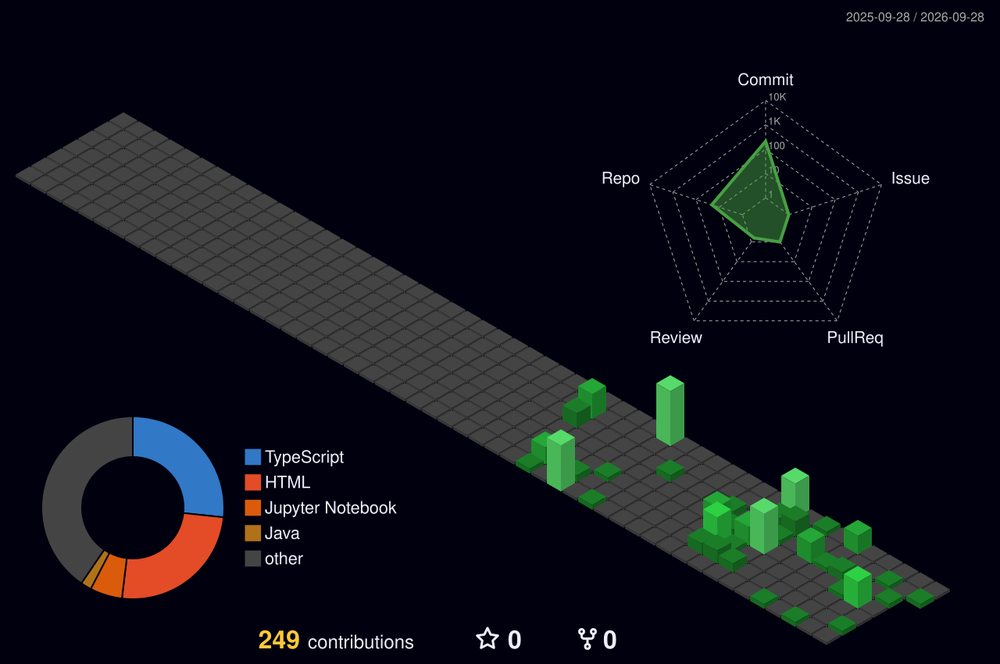

<div align="center">


<br/>
<a href="https://abdul-wahid-portfolio.vercel.app/CV.pdf">
  
</a>

</div>

---

## About Me

```python
class AbdulWahid:
    def __init__(self):
        self.name        = "Abdul Wahid"
        self.role        = "AI / ML Developer"
        self.university  = "COMSATS University Islamabad, ATTOCK Campus"
        self.degree      = "BS Artificial Intelligence"
        self.location    = "Pakistan"
        self.email       = "inbox.abdulwahid@gmail.com"
        self.website     = "https://www.abdulwahid.me"
        self.languages   = ["Python", "Java"]
        self.interests   = ["Machine Learning", "Data Science", "Software Engineering", "AI Research"]
        self.available   = True  # Open to opportunities!

    def say_hi(self):
        print("Thanks for stopping by! Let's build something amazing with AI")

me = AbdulWahid()
me.say_hi()
```

---

## Connect With Me

<div align="center">

[![Portfolio](https://img.shields.io/badge/-000000?style=for-the-badge&logo=data:image/png;base64,iVBORw0KGgoAAAANSUhEUgAAAGQAAABkCAYAAABw4pVUAAAACXBIWXMAAAsTAAALEwEAmpwYAAADbklEQVR4nO3dSWwOYRzH8VFLbAdx4G6Jm1oOtsYWBxJpbT1y4OJGXIh9uSFOEluLiDiUoBJngpCII9JYDhUJTiSWkpKvPOkjepDq23nmff7zzO%2BTTNKkms5%2Fvkpn3uedyTIRERERERERERHJDRgFtAA7A23NwMjYc5USMB3oIrznwLTY85XxJ6OrgBj9o%2BgnZbCANRSvOUsJMB5Y4P%2BNbw28Xa5DkMsF7HeLPybj6hliNnAD6KnDQSsrd2yuA41FhhgGHAR%2BxZ62RNyx2ueOXRFBTsSersSOh46xPvZECVgTKsYI4GXsaRLwAhgeIsiy2JMkZHGIIIdjT5GQQyGCXIg9RULaQwTpiD1FQjoUxBYFMUZBjFEQYxTEmKSDfPH7thVY7Tf38VXgKzYlG%2BQUMGmAfZ4MnMWe5IL0Ahtr2PdNwE%2FsSC7ItiHs%2F3bsSCrIo6G%2B0AM8wIakgqzMMcMqbEgmyMc8y3b8sqJPsYdIKciDAHM8jD1ESkE6A8zRGXuIlILcCzDH%2FdhDpBTkPdCQY4YG4EPsIVIK4izIMcNCbEgqyM0cM9zChqSCDGltE7AOO5IL8hlYVMO%2BN%2FmvsSK5IM53d01roBNFfyK4A%2FiBLUkG%2BeOVXzO2BJjiN%2FfxEeA1NiUdpIwUxBgFMSbpIN3%2Bcsht4IrfbvvXPtznLEomSDdwCdgMzHXvbxzkeyDdn93iv%2FZN7CHKHuQpsMv99pR7iL%2BzTAV2A88izVS6IL3AeWBWkAL%2Ff%2FPqBf8966U0QdzKkIvub3CQo137HSMu1Wl1SimCuLd6zQ9ydHPwV4TdyWalg9wBJmRGABOBu1UN8riudzwYJP%2Fb2ZOqBXEXCGdkRtH3%2F0pPlYKcy4wD2qsUpLmidyTqsBpkTmYcfWf5lQmyNDMOWF6lIHsz44ADVQryFhiTGQWMLuiKsdkgzsnMKOB0QTObDuKcsXRySN9JYVuB85oP4rwDjgEbgBWRNve9j%2Fslq1Q9SJV0KIgtCmKMghijIMYoSIpB3KIDCaMtRBDdBDOcgyGCuBXlEkZTiCDD%2FcoQyacryI2UfZS1OXdGCPwqqb%2FWI0NzNGiMfo%2Br2K%2FHVdTEHas9hTyuol%2BYRv%2Bwkm%2B17VulfAOuATMLC%2FGPMOOAeQU98qi1pFuLPyZj6xZCREREREREREREREQkK5ffsLFpVV%2F956wAAAAASUVORK5CYII%3D)](https://www.abdulwahid.me)
[](https://github.com/abduIwahid)
[](https://linkedin.com/in/abdu1wahid)
[](mailto:abdulwahid.connects@gmail.com)
[](https://wa.me/923078141252)

</div>

---

## Tech Stack & Skills

<div align="center">

**Languages**<br/>


<br/><br/>

**AI / Machine Learning**<br/>


<br/><br/>

**Web & Backend**<br/>


<br/><br/>

**Tools & Platforms**<br/>


</div>

---

## GitHub Stats

<div align="center">


<br/>
<br/>



</div>

---

## Education

<div align="center">

| Degree | Institution | Semester | CGPA |
|:------:|:-----------:|:------:|:------:|
| BS Artificial Intelligence | COMSATS University Islamabad, ATTOCK Campus | 5th | 3.46 |

</div>

---

<h2 align="center">Certificates & Achievements</h2>

<div align="center">

**[View Full Certificates Repository →](https://github.com/abduIwahid/certificates)**

| Credential | Issuer | Date | Skills | Proof |
|:-----------|:-------|:-----|:-------|:------|
| [**Google AI Essentials**](https://github.com/abduIwahid/certificates/tree/main/google-ai-essentials)<br/><sub>Specialization · 5 Courses</sub> | Google via Coursera | May 2026 | AI · Prompt Engineering · Productivity | [Verify](https://coursera.org/verify/specialization/ET3L35MRSLBI) |
| [**ML with NumPy, pandas**](https://github.com/abduIwahid/certificates/tree/main/machine-learning-numpy-pandas)<br/><sub>Completion · 15 Hours</sub> | Educative.io | May 2026 | NumPy · pandas · scikit-learn | [Verify](https://drive.google.com/file/d/1iCF1dC5lXYNjqLK-9EoYhNlrG8B_9QV0/view) |
| [**MTM AI Hackathon**](https://github.com/abduIwahid/certificates/tree/main/mtm-ai-hackathon-2026)<br/><sub>Participation</sub> | GDGoC, COMSATS Wah | May 12, 2026 | AI Hackathon · Problem Solving | [Verify](https://drive.google.com/file/d/1UGs2P9JgDlXth--FgMtQXr_n10pAjnsu/view) |


</div>

---

<h2 align="center">Recent Projects & Contributions</h2>

<table>
  <tr>
    <td width="24%" valign="top"><a href="https://github.com/abduIwahid/MediSight-Healthcare-Platform"><b>MediSight</b></a><br/><sub>Healthcare AI</sub></td>
    <td valign="top">
      A full-stack AI-powered clinical assistant. Integrated FastAPI ML services with Next.js & Supabase, managing MLOps and production CI/CD pipelines.<br/><br/>
      
      
      
      
      <br/><br/>
      <a href="https://github.com/abduIwahid/MediSight-Healthcare-Platform">Repository</a> · <a href="https://medisight-healthcare.vercel.app/welcome">Live Demo</a>
    </td>
  </tr>
  <tr>
    <td valign="top"><a href="https://github.com/abduIwahid/Predictly"><b>Predictly</b></a><br/><sub>Predictive Analytics</sub></td>
    <td valign="top">
      A robust machine learning platform for predictive analytics and data-driven insights.<br/><br/>
      <a href="https://github.com/abduIwahid/Predictly">Repository</a> · <a href="https://predict-home.vercel.app/">Live Demo</a>
    </td>
  </tr>
  <tr>
    <td valign="top"><a href="https://github.com/abduIwahid/Customer-Churn-Prediction"><b>Churnex</b></a><br/><sub>Customer Churn</sub></td>
    <td valign="top">
      AI-powered customer churn prediction platform built with a Multi-Layer Perceptron (MLP) neural network, SHAP explainability, and a FastAPI backend with a dark glassmorphism UI.<br/><br/>
      
      
      <br/><br/>
      <a href="https://github.com/abduIwahid/Customer-Churn-Prediction">Repository</a> · <a href="https://churnex.vercel.app/">Live Demo</a>
    </td>
  </tr>
  <tr>
    <td valign="top"><a href="https://github.com/abduIwahid/Smart-Doctor-Connect"><b>Smart Doctor Connect</b></a><br/><sub>MTM AI Hackathon</sub></td>
    <td valign="top">
      A specialized healthcare assistant leveraging AI/ML to enhance medical decision-making and accessibility, developed during the MTM AI Hackathon.<br/><br/>
      <a href="https://github.com/abduIwahid/Smart-Doctor-Connect">Repository</a> · <a href="https://smartdoctor-ai.vercel.app/">Live Demo</a>
    </td>
  </tr>
  <!-- NEW -->
  <tr>
    <td valign="top"><a href="https://github.com/abduIwahid/fa24-bai"><b>Study Hubb</b></a><br/><sub>Study Platform</sub></td>
    <td valign="top">
      A study hub for the FA24-BAI 5th semester cohort, with an AI assistant powered by the Gemini API.<br/><br/>
      <br/><br/>
      <a href="https://github.com/abduIwahid/fa24-bai">Repository</a> · <a href="https://fa24-bai.vercel.app">Live Demo</a>
    </td>
  </tr>
  <!-- NEW: confirm this repo is public, otherwise remove the Repository link -->
  <tr>
    <td valign="top"><a href="https://github.com/abduIwahid/epms"><b>EPMS</b></a><br/><sub>Web Technologies Project</sub></td>
    <td valign="top">
      Enterprise Project Management System: a full-stack engineering collaboration platform with sprints, tasks, a drag-and-drop Kanban board, threaded comments with @mentions, real-time updates, and Admin / Project Manager / Team Member roles.<br/><br/>
      <a href="https://github.com/abduIwahid/epms">Repository</a>
    </td>
  </tr>
</table>

<details>
<summary><b>More projects</b></summary>
<br/>

<table>
  <tr>
    <td width="24%" valign="top"><a href="https://github.com/abduIwahid/Freelance-MarketPlace-Management-System"><b>Freelance Marketplace Management System</b></a></td>
    <td valign="top">
      SQL-based backend for managing freelancers, clients, projects, bids, and payments. Focuses on efficient data design, optimized queries, and secure transactions.<br/><br/>
      
    </td>
  </tr>
  <tr>
    <td valign="top"><a href="https://github.com/abduIwahid/Inventory-Management-System"><b>Inventory Management System</b></a></td>
    <td valign="top">
      OOP-based Java project (built in NetBeans) for managing products, stock levels, sales, and suppliers, using classes, inheritance, and encapsulation.<br/><br/>
      
    </td>
  </tr>
  <tr>
    <td valign="top"><a href="https://github.com/abduIwahid/Pac-Man"><b>Pac-Man</b></a></td>
    <td valign="top">
      A maze game: eat every pellet while 3-4 ghosts chase you, and grab a Power Pellet to turn the tables.<br/><br/>
      
    </td>
  </tr>
</table>

</details>

---

<h2 align="center">What I'm Working On</h2>

<div align="center">

<table>
  <tr><td>Building intelligent AI/ML solutions for real-world problems</td></tr>
  <tr><td>Exploring data science and predictive modeling</td></tr>
  <tr><td>Deepening expertise in deep learning and neural networks</td></tr>
  <tr><td>Developing my portfolio at <a href="https://www.abdulwahid.me">abdulwahid.me</a></td></tr>
  <tr><td>Growing <a href="https://github.com/abduIwahid/fa24-bai">Study Hubb</a> and shipping EPMS</td></tr>
</table>

</div>

---

<h2 align="center">Fun Facts</h2>

<div align="center">

> *I see every problem as a dataset waiting to be understood.*
>
> *Python is my weapon of choice for ML experimentation.*
>
> *Goal: leverage AI to make a real-world impact.*

</div>

---

<div align="center">


<sub><i>"The goal of AI is not to replace human intelligence, but to augment it."</i></sub>

⭐ **If you find my projects useful, consider giving them a star!** ⭐

</div>
